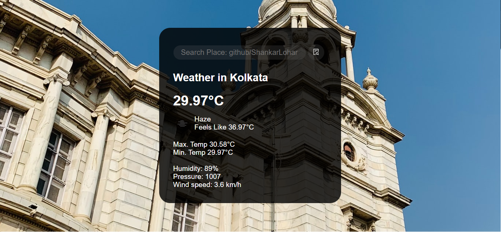

# Weather Teller
This website is made to learn APIs and its usage.
## Features
- Tells Weather related details of a specific place at a time.
- Can search for the weather of any place.
- Changes background according to the place searched.


  
## Screenshots



  
## API Reference

```http
  https://openweathermap.org/api
```

## Future Improvement
- Add *Geo-Location* feature to automatically detect the place.